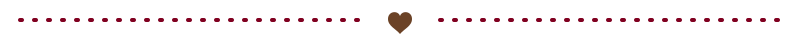
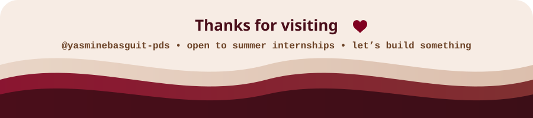

<div align="center">



<br>


<br><br>

[](https://github.com/yasminebasguit-pds)


-E0A96D?style=for-the-badge&labelColor=6B4226)



</div>

### 🍷 About Me

> I'm a second-year Computer Science student at Constructor University in Germany, building myself in tech one project at a time. I love maths, databases and anything I can take apart to see how it works. Very social, very passionate, very burgundy. 🤎

```yaml
yasminebasguit-pds:
  name: "Yasmine"
  university: "Constructor University, Germany 🇩🇪 · CS, 2nd year 🎓"
  currently_building: "Online Schema: a MariaDB database with my team of 4"
  studying: ["Databases", "Operating Systems", "C/C++", "Linear Algebra", "Probability", "Robotics"]
  languages_code: ["Python", "C", "C++", "SQL"]
  languages_human: ["English", "French", "Arabic", "German (basic)", "Italian (basic)"]
  looking_for: "a 2-month summer internship 🚀"
  loves: ["maths ", "laughing ", "meeting people ","Social media", "Events Planning"]
  motto: "Burgundy, loud and building "
```

<div align="center"></div>

### 🛠️ Projects

<table>
<tr>
<td width="50%" valign="top">

**📦 [Stock Manager](https://github.com/yasminebasguit-pds/stock-manager)**

A desktop inventory app with products, stock movements, PDF invoices, 4 user roles, audit logs and backups.

`Python` `PySide6` `SQLite` `16 tests ✓`


</td>
<td width="50%" valign="top">

**🗄️ Online Schema** · *in progress*

Team project (4 people) for the Databases course: designing a relational schema and populating it with data in MariaDB.

`MariaDB` `SQL` `Teamwork`

</td>
</tr>
</table>

### 💻 Terminal

<div align="center">

</div>

### 🧸 Tech Stack

<div align="center">


<br><br>


</div>

### 🌹 My Journey

```mermaid
%%{init: {'theme':'base','themeVariables':{'primaryColor':'#E8D3C4','primaryTextColor':'#4A0E1A','primaryBorderColor':'#800020','lineColor':'#800020','secondaryColor':'#C9A18A','tertiaryColor':'#F7ECE4'}}}%%
flowchart LR
    A([🌐 Networking]) --> B([🐍 Python])
    B --> C([⚙️ C / C++])
    C --> D([🗄️ Databases])
    D --> E([🛠️ Building projects])
    E --> F([✨ Summer internship])
    style A fill:#F7ECE4,stroke:#800020,color:#4A0E1A
    style B fill:#E8D3C4,stroke:#800020,color:#4A0E1A
    style C fill:#C9A18A,stroke:#4A0E1A,color:#2E0F14
    style D fill:#6B4226,stroke:#4A0E1A,color:#FFFFFF
    style E fill:#800020,stroke:#4A0E1A,color:#FFFFFF
    style F fill:#E0A96D,stroke:#6B4226,color:#2E0F14
```



<div align="center"></div>

<div align="center">



<br>



</div>

### 🔮 Fun Facts

<details>
<summary><b>Click to reveal ✨</b></summary>

- Very easygoing and always open to new experiences 
-  My laugh arrives before the joke does
- 🗣️ Five languages, two of them still in progress
-  Studying and going out are both non-negotiable

</details>

### 📊 GitHub Stats

<div align="center">


<br>


<br><br>

<picture>
  <source media="(prefers-color-scheme: dark)" srcset="https://raw.githubusercontent.com/yasminebasguit-pds/yasminebasguit-pds/output/snake-dark.svg" />
  <source media="(prefers-color-scheme: light)" srcset="https://raw.githubusercontent.com/yasminebasguit-pds/yasminebasguit-pds/output/snake.svg" />
  
</picture>

</div>

<div align="center">

</div>
